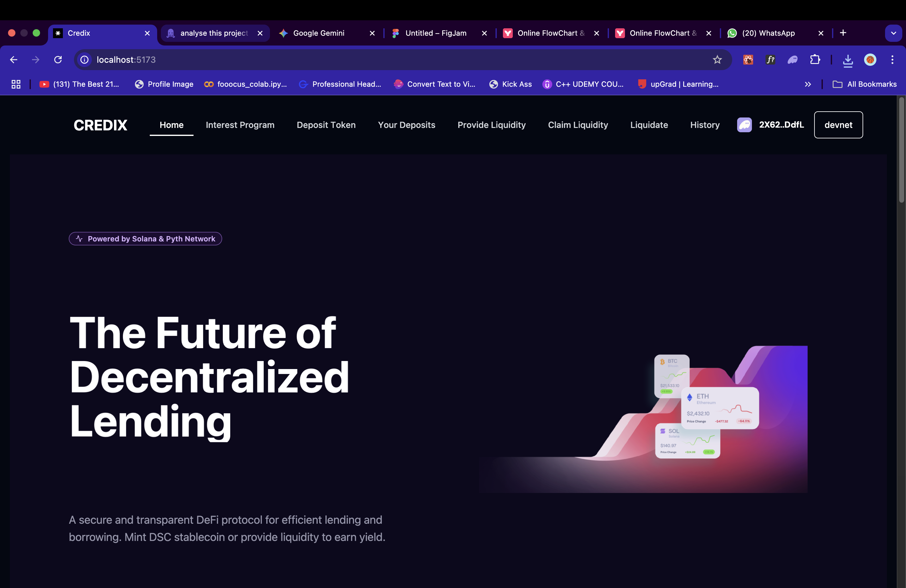
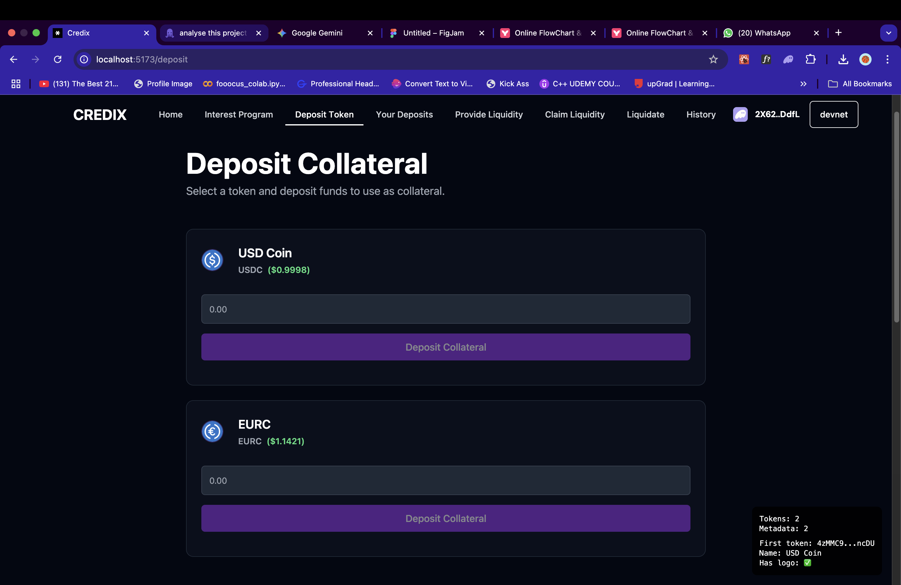

# CredixSolana Codebase Analysis Report

A comprehensive analysis of the CredixSolana decentralized finance protocol.

### Demo Video

https://drive.google.com/file/d/1nH1-U5taYSPiEYxgRFSXEEZxL0RNyEuA/view?usp=sharing

### Deployed Link

https://ninad00.github.io/CredixSolana/

### Screenshots




### 📊 Workflow Diagram

For detailed workflow diagrams and architecture documentation, see [WORKFLOW.md](./WORKFLOW.md)

---

## 1. Project Overview

CredixSolana is a decentralized finance (DeFi) protocol built on the Solana blockchain using the Anchor framework. It appears to be a lending/borrowing platform with features for collateralized debt positions, liquidity provision, and automated liquidations.

---

## 2. System Architecture

### 2.1. Frontend (React + TypeScript)

-   **Framework**: `React 19` with `TypeScript`
-   **Build Tool**: `Vite`
-   **UI Components**:
    -   Radix UI primitives for accessible components
    -   Tailwind CSS for styling
    -   Framer Motion for animations
    -   Lucide icons

### 2.2. Blockchain Integration

-   **Wallet Integration**:
    -   `@solana/wallet-adapter` for wallet connections
    -   Support for various Solana wallets
-   **Smart Contracts**:
    -   Built with Anchor (`Rust`)
    -   **Program ID**: `J4bfWKCuz2J1gzbwhosrhRV5Q1bQATjvAmnzP7SMYptY` (devnet)

### 2.3. Backend Services

-   Solana RPC nodes for blockchain interaction
-   Price feeds integration (potentially Pyth Network based on imports)

---

## 3. Directory Structure

### 3.1. Root Directory

-   `/anchor` - Smart contract code and configurations
-   `/public` - Static assets
-   `/src` - Frontend source code
    -   `/components` - React components
    -   `/config` - Configuration files
    -   `/lib` - Utility functions
    -   `/utils` - Helper functions

---

## 4. Key Components

### 4.1. Smart Contracts (Anchor Program)

-   **Main Program**: Implements core lending protocol logic.
-   **Key Modules**:
    -   `deposit`: Handle collateral deposits
    -   `withdraw`: Handle collateral withdrawals
    -   `engine`: Core protocol logic
    -   `lp`: Liquidity provider functionality
    -   `pricefeeds`: Oracle price feed integration

### 4.2. Frontend Components

-   **Interest Management**:
    -   `interest-feature.tsx`: Main dashboard for interest program
    -   `depositToken.tsx`: Deposit collateral interface
    -   `mint&withdraw.tsx`: Mint and withdraw DSC tokens
    -   `giveLiquidity.tsx`: Provide liquidity to the protocol
    -   `liquidate.tsx`: Liquidate undercollateralized positions

---

## 5. Core Features

### 5.1. Collateral Management

-   Users can deposit supported tokens as collateral.
-   Collateral is used to back minted **DSC** (Decentralized Stable Coin).
-   Health factor monitoring for positions.

### 5.2. Lending/Borrowing

-   Mint **DSC** against deposited collateral.
-   Interest rate calculations.
-   Loan-to-value ratio enforcement.

### 5.3. Liquidity Provision

-   Users can provide liquidity to the protocol.
-   Earn fees from protocol operations.
-   Withdraw liquidity with accrued rewards.

### 5.4. Liquidations

-   Automated liquidation of undercollateralized positions.
-   Liquidation bonus for liquidators.
-   Health factor monitoring.

---

## 6. Technical Stack

### 6.1. Frontend

-   **UI Framework**: `React 19`
-   **State Management**: `Jotai`
-   **Styling**: `Tailwind CSS`
-   **Form Handling**: `React Hook Form`
-   **Data Fetching**: `@tanstack/react-query`
-   **Wallet Integration**: `@solana/wallet-adapter`

### 6.2. Smart Contracts

-   **Language**: `Rust`
-   **Framework**: `Anchor`
-   **Key Dependencies**:
    -   `anchor-lang`: Core Anchor framework
    -   `spl-token`: Token program interactions
    -   `spl-associated-token-account`: Associated token accounts

---

## 7. Important Terminology

-   **DSC**: Decentralized Stable Coin, the stablecoin minted by the protocol.
-   **Health Factor**: A metric determining the safety of a position.
-   **LTV (Loan-to-Value)**: The ratio of the borrowed amount to the collateral value.
-   **Liquidation Threshold**: The LTV at which a position becomes eligible for liquidation.
-   **Liquidation Bonus**: An incentive given to liquidators.

---

## 8. Deployment

### 8.1. Development

-   Local development using Anchor's local validator.
-   Testnet deployment on Solana devnet.

### 8.2. Production

-   Mainnet deployment configuration is available.
-   Program upgrades are handled through Anchor's program deployment flow.

---

## 9. Security Considerations

-   Role-based access control in smart contracts.
-   Price oracle integration for accurate collateral valuation.
-   Slippage protection for transactions.
-   Comprehensive error handling and validation.

---

## 10. Development Setup

### 10.1. Prerequisites

-   Node.js (v18+)
-   Rust (latest stable)
-   Solana CLI
-   Anchor CLI

### 10.2. Installation

```bash
# Install dependencies
npm install

npm run dev
```

### 11 Testing

- Unit tests for smart contracts.
-Integration tests for end-to-end flows.
-Test coverage reporting.
### 12 conclusion

CredixSolana is a sophisticated DeFi protocol that brings decentralized lending and borrowing to the Solana blockchain. With its modular architecture and comprehensive feature set, it provides a solid foundation for building a robust financial ecosystem. The codebase follows modern development practices and includes thorough testing and security considerations.

