# CredixSolana Workflow Diagram

This document provides comprehensive workflow diagrams for the CredixSolana DeFi lending protocol.

---

## Table of Contents
1. [System Architecture](#system-architecture)
2. [User Workflows](#user-workflows)
3. [Smart Contract Modules](#smart-contract-modules)
4. [Component Interaction Flow](#component-interaction-flow)

---

## System Architecture

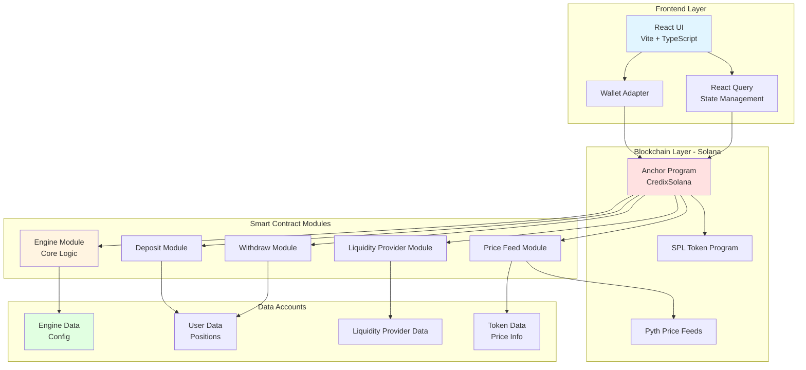

---

## User Workflows

### 1. Deposit Collateral Workflow

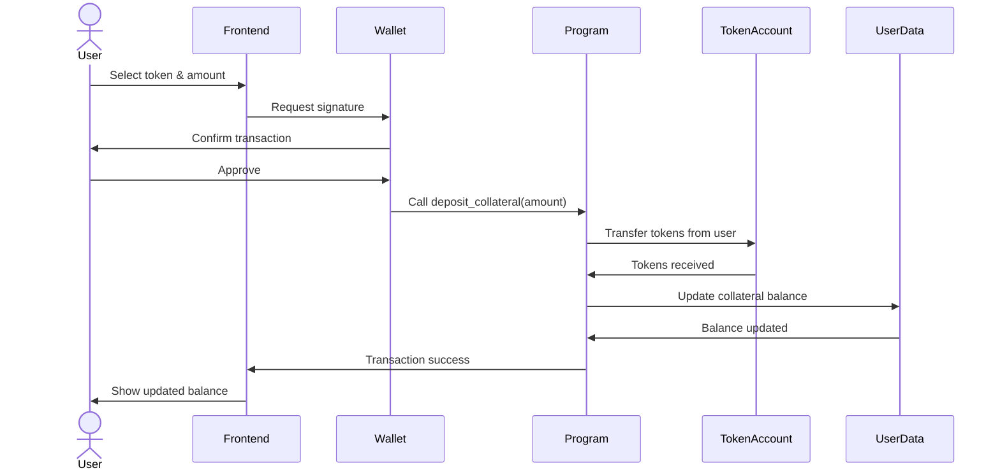

### 2. Mint DSC (Borrow) Workflow

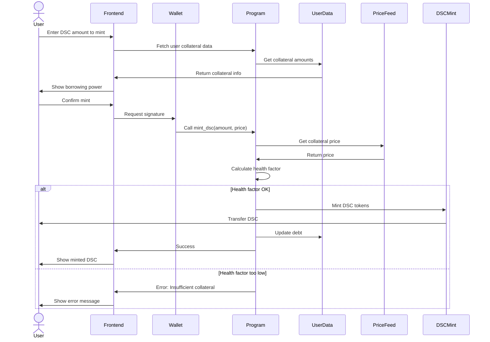

### 3. Liquidation Workflow

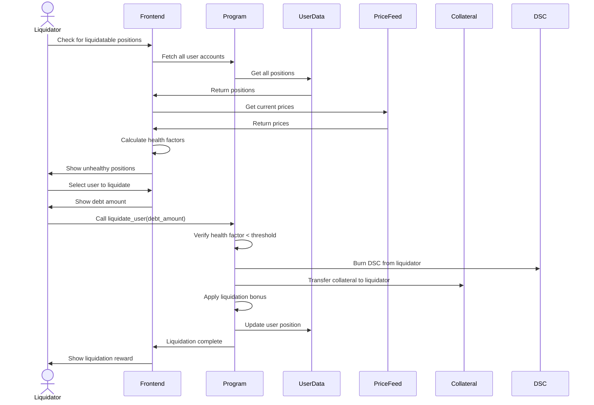

### 4. Liquidity Provider Workflow

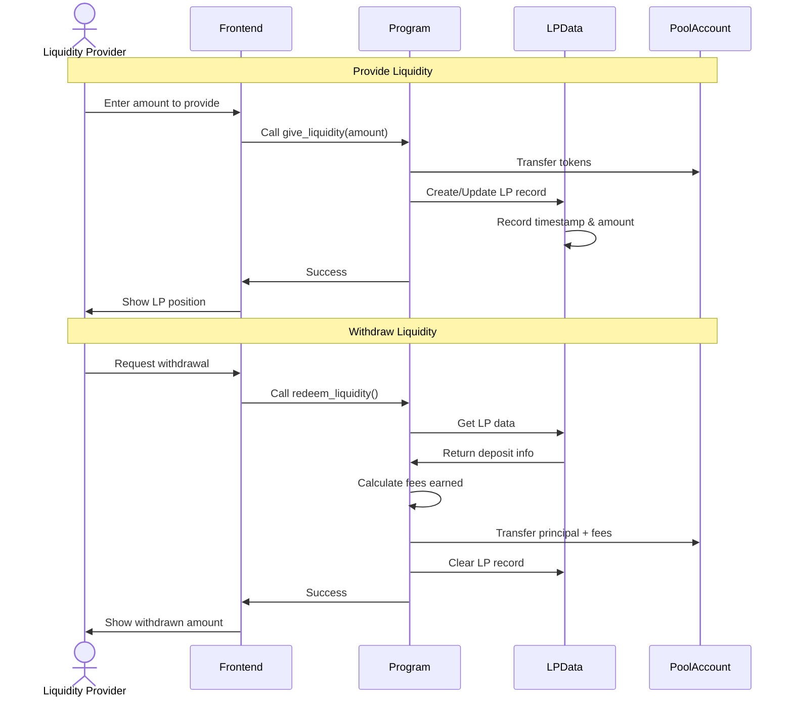

---

## Smart Contract Modules

### Module Structure and Interactions

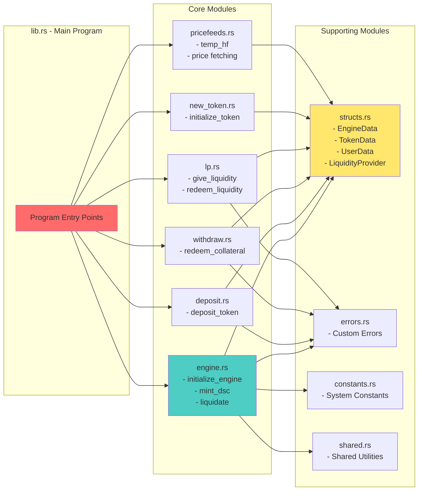

### Key Smart Contract Functions

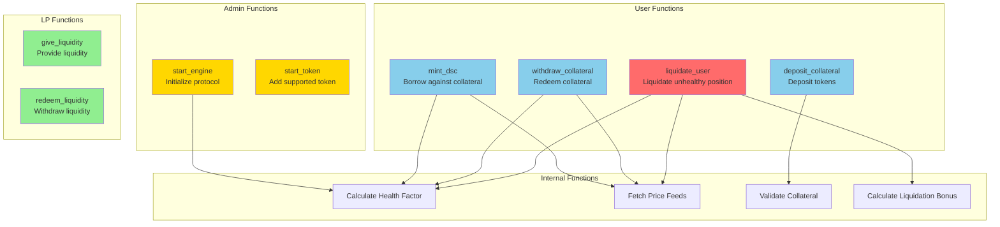

---

## Component Interaction Flow

### Frontend Component Architecture

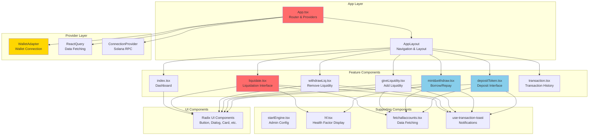

### Data Flow: Deposit to Borrow Journey

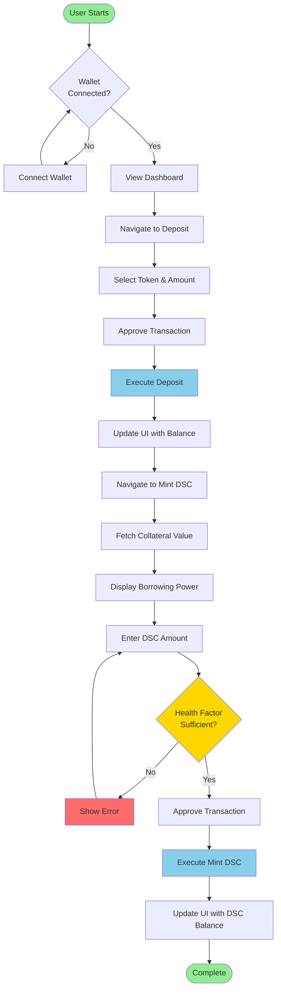

### Complete Transaction Flow

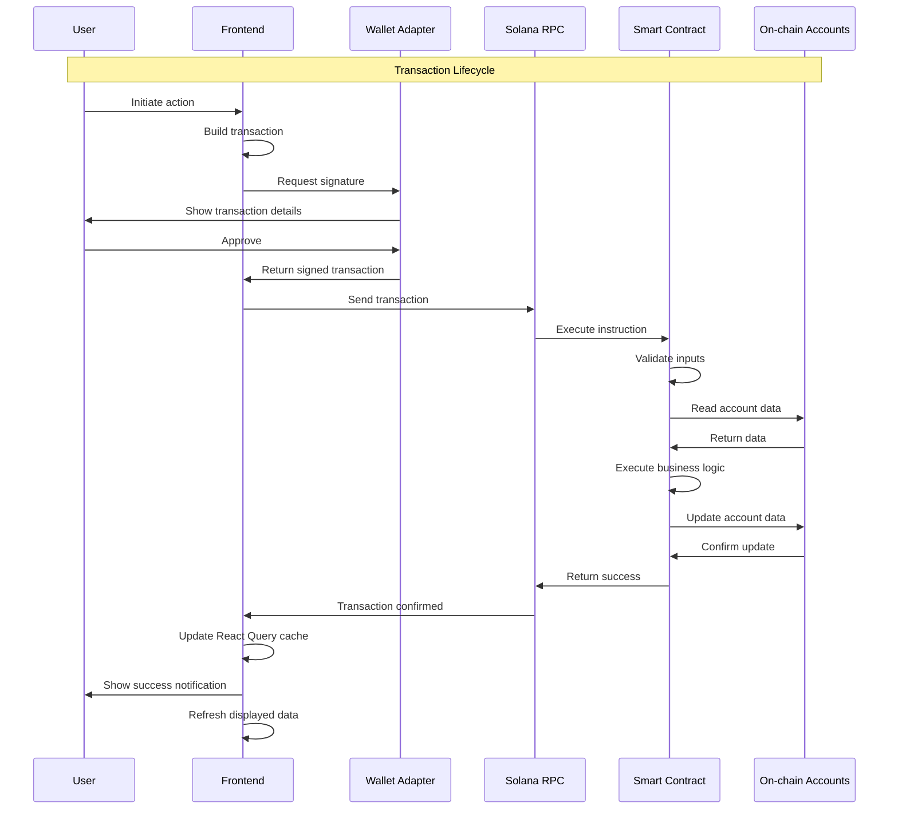

---

## Key Concepts

### Health Factor Calculation

The health factor determines the safety of a user's position:

```
Health Factor = (Collateral Value × Liquidation Threshold) / Total Debt

- If HF < Min Health Factor (typically 1.0): Position can be liquidated
- If HF > Min Health Factor: Position is safe
```

### Liquidation Process

When a position becomes unhealthy:
1. Liquidator identifies undercollateralized position
2. Liquidator provides DSC to cover debt
3. Liquidator receives collateral + liquidation bonus
4. User's debt is reduced/cleared
5. User's collateral is reduced

### Liquidity Provider Rewards

LPs earn fees from:
- Minting fees
- Liquidation fees
- Protocol operations

Fees are distributed proportionally based on:
- Amount provided
- Time in pool

---

## Technology Stack Summary

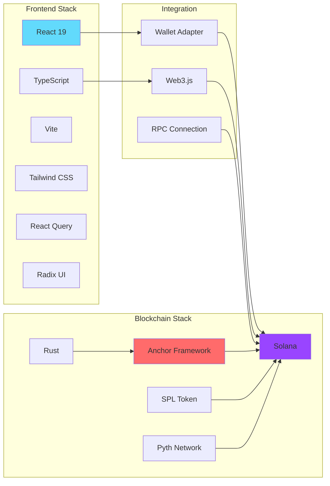

---

## Deployment Architecture

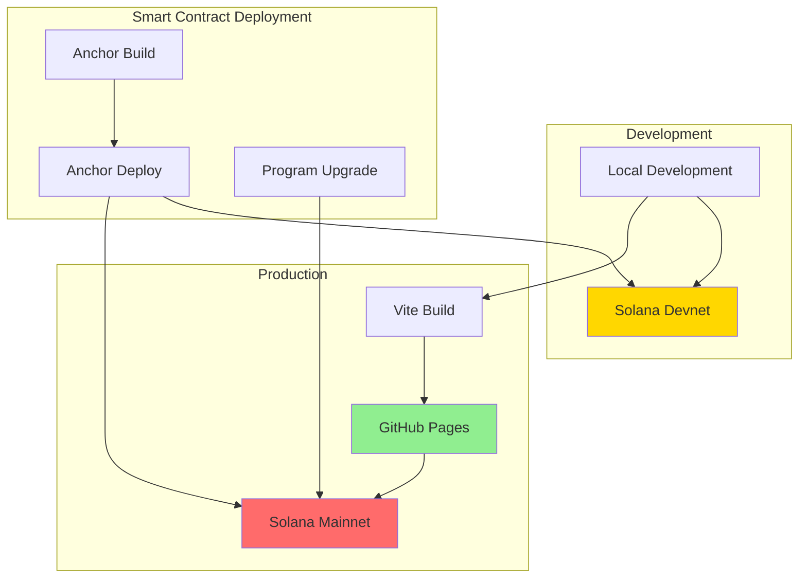

---

## Error Handling Flow

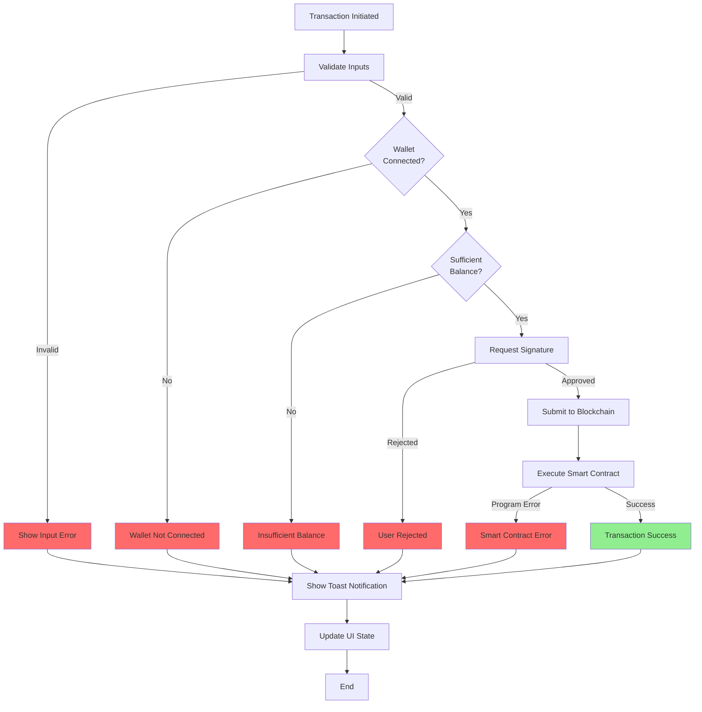

---

## Conclusion

This workflow documentation provides a comprehensive view of the CredixSolana protocol, including:
- High-level system architecture
- Detailed user workflows for all major features
- Smart contract module interactions
- Frontend component structure
- Data flow and transaction lifecycle
- Error handling mechanisms

The protocol enables users to:
1. **Deposit** collateral tokens
2. **Mint** DSC stablecoin against collateral
3. **Provide** liquidity to earn fees
4. **Liquidate** unhealthy positions for rewards
5. **Withdraw** collateral and liquidity

All operations are secured by health factor checks and managed through the Anchor framework on Solana blockchain.
